# Proyecto Lab10_Gjango

Este repositorio contiene el trabajo en grupo para el proyecto Lab10_Gjango.

## Integrantes del equipo

- Jilder Alex Dionisio Rojas
- Adriana Chinchayhuara
- Naomi Veliz

### Tecnologías utilizadas

- React 19
- Vite
- ESLint

### Comandos útiles

Desde la carpeta `Jilder Dionisio/cinespoilers/`:

```bash
npm install
npm run dev
npm run build
npm run preview
npm run lint
```

## Evidencias del trabajo

### Jilder Alex Dionisio Rojas

Las capturas actuales en la carpeta `doc/` son evidencia del trabajo del equipo.

#### Proyecto limpio, renderizado y sin errores

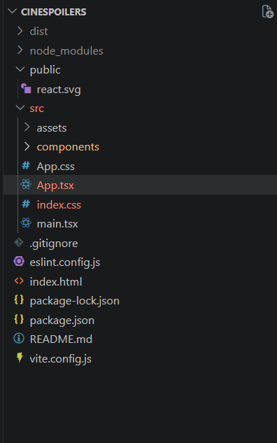

#### Creación de componente con variables y uso

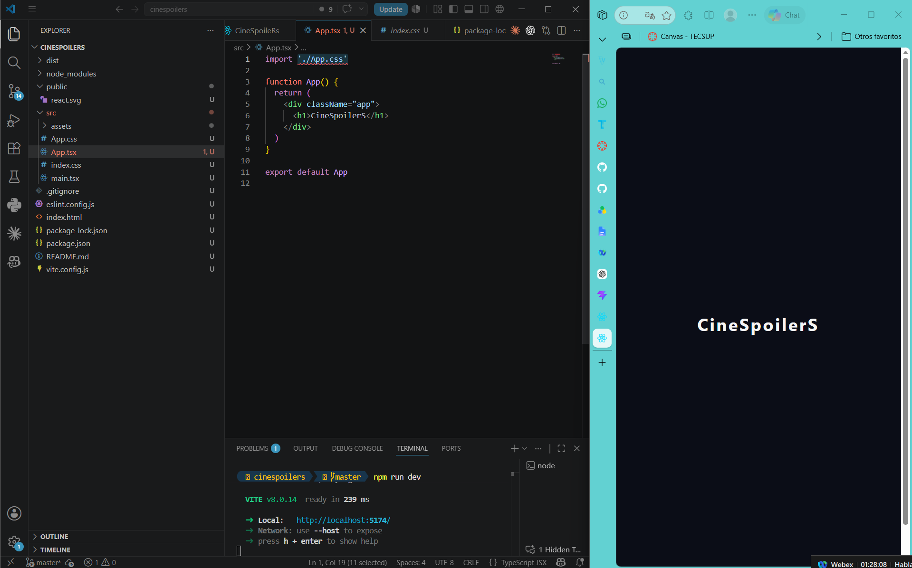

#### Props en el componente creado

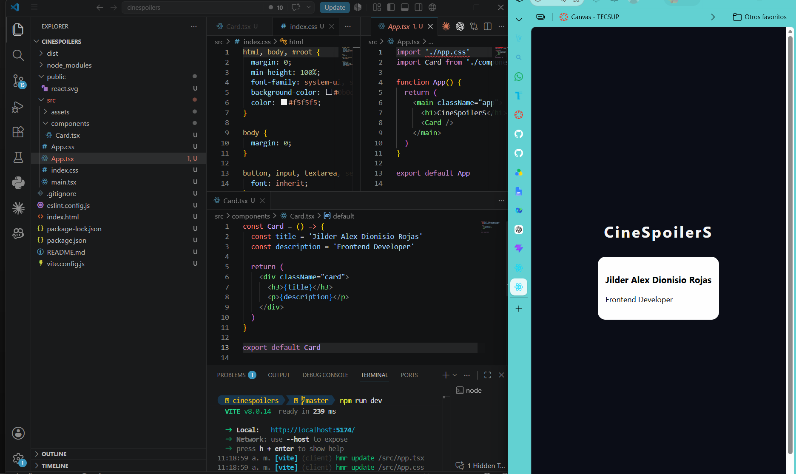

#### Estado en el componente

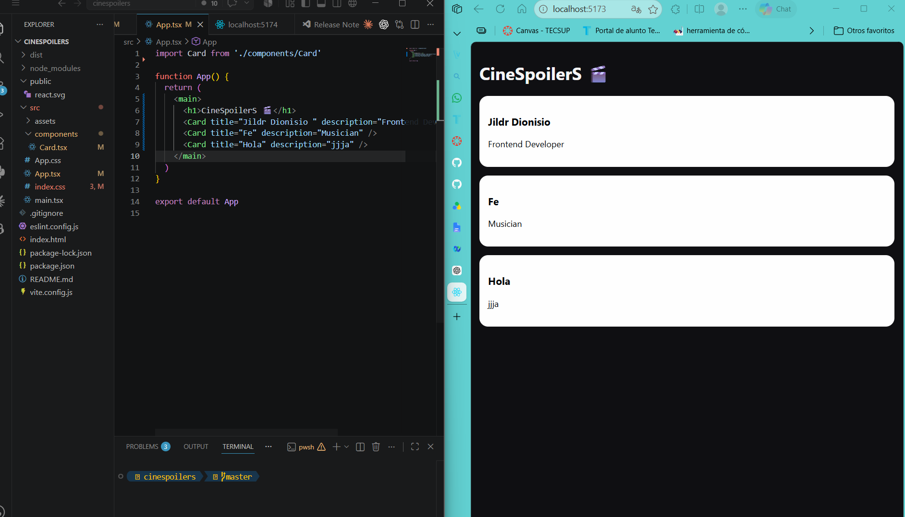

#### Manejo de estado mediante eventos

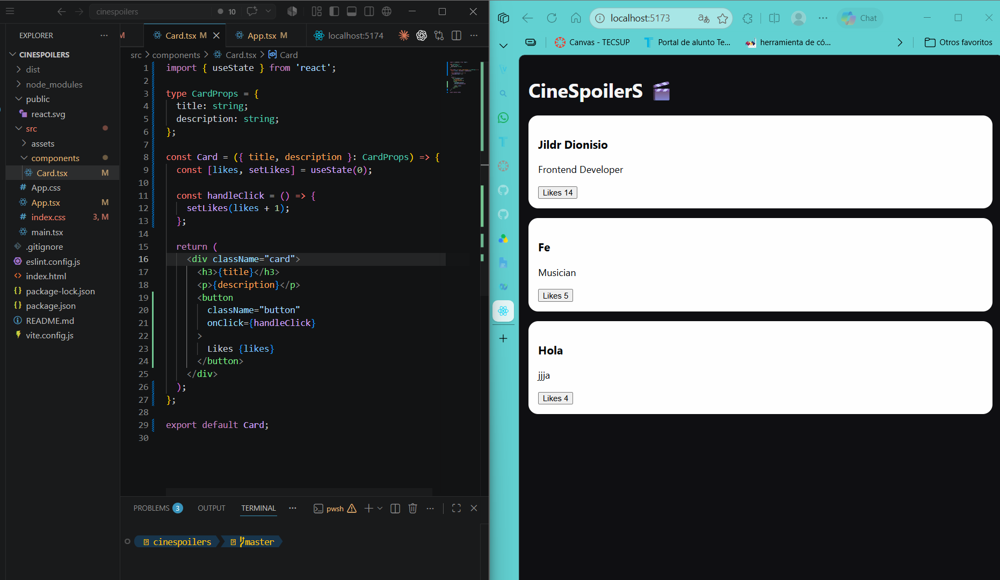


### Adriana Chinchayhuara

Evidencias:

#### Proyecto limpio, renderizado y sin errores

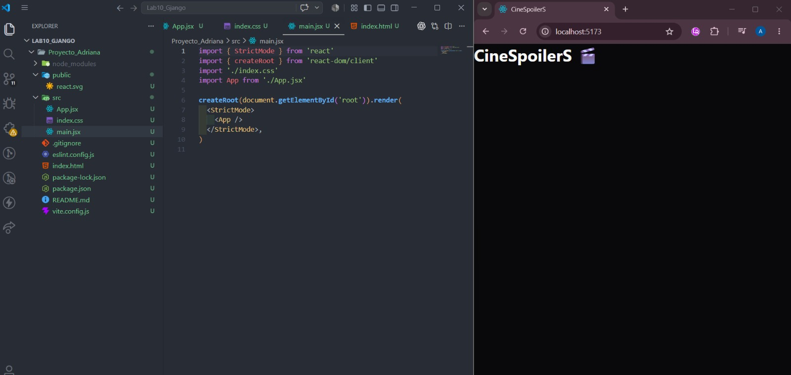

#### Creación de componente con variables y uso

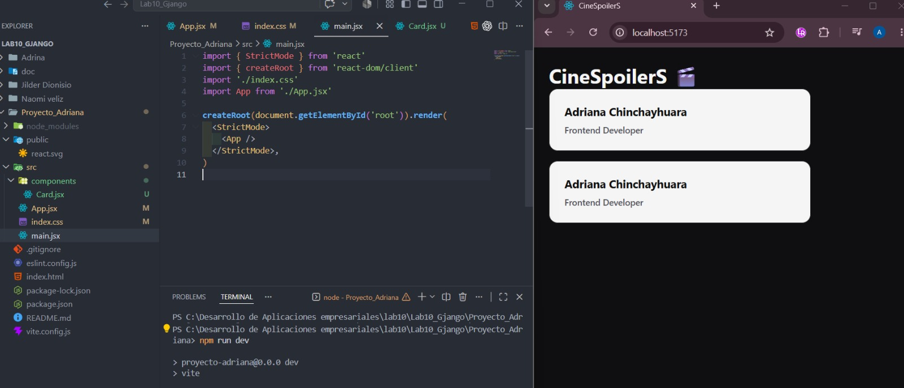

#### Props en el componente creado

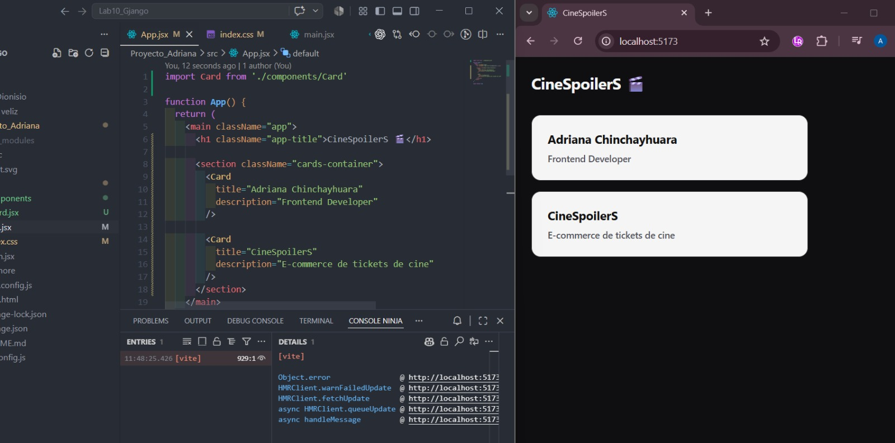

#### Estado en el componente

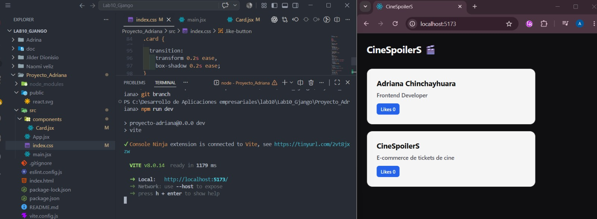

#### Manejo de estado mediante eventos

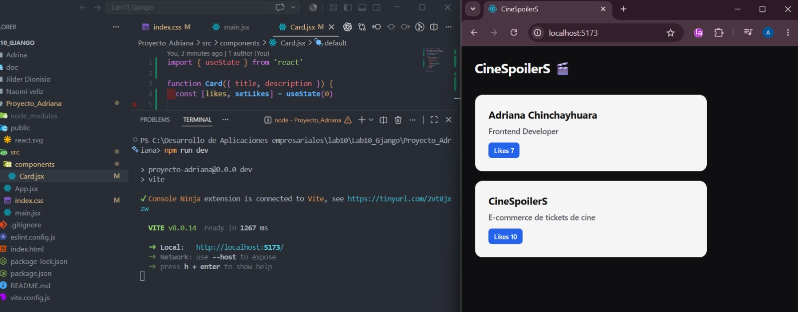


### Naomi Veliz

Las evidencias de Naomi Veliz deben agregarse en la sección correspondiente cuando estén disponibles.

#### Proyecto limpio, renderizado y sin errores
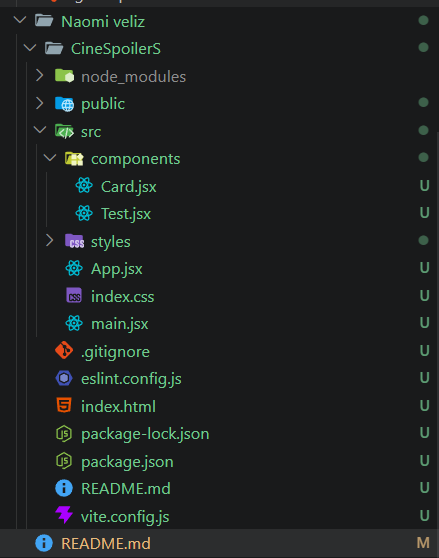
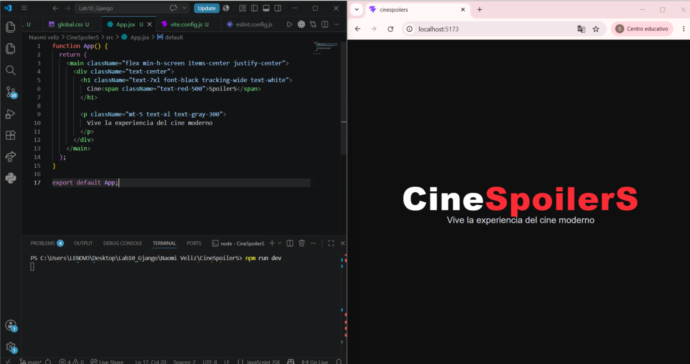

#### Creación de componente con variables y uso.
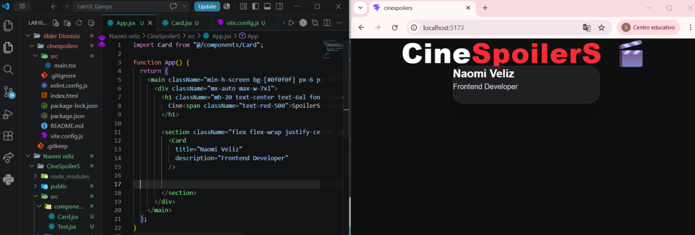

#### Props en el componente creado
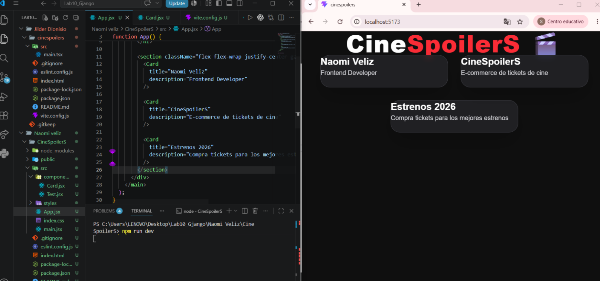

#### Estado en el componente
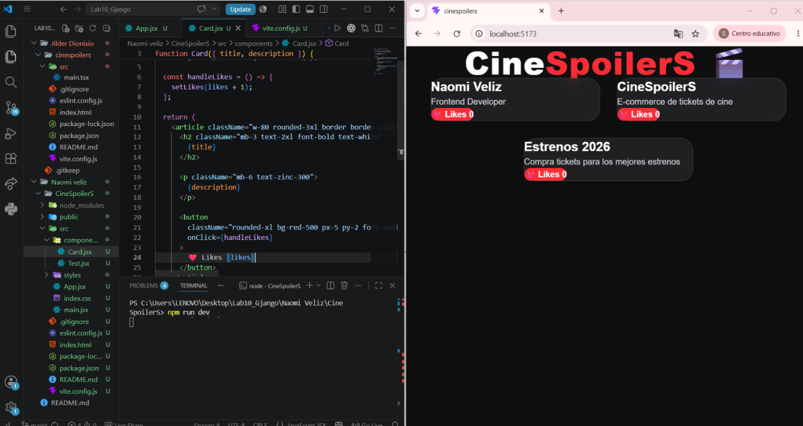

#### Manejo de estado mediante eventos
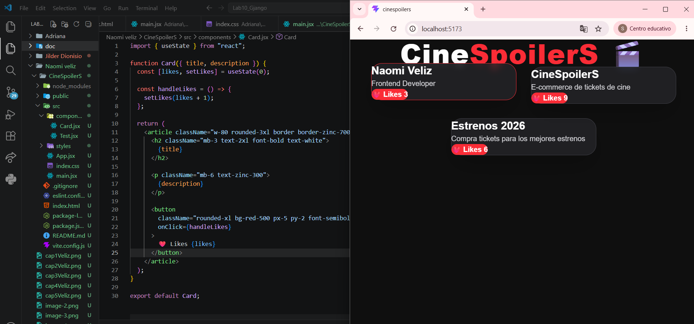

## Notas

- El repositorio puede contener material adicional en `Adriana/` y `Naomi veliz/`.
- El README se enfoca en el subproyecto principal y las evidencias de grupo.
